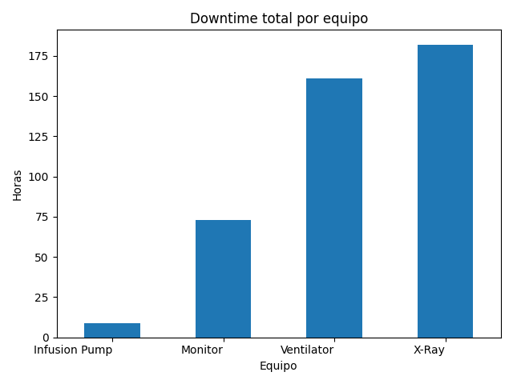
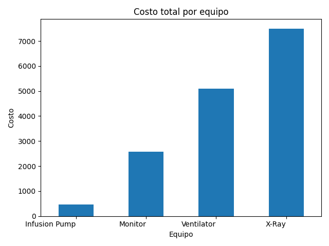
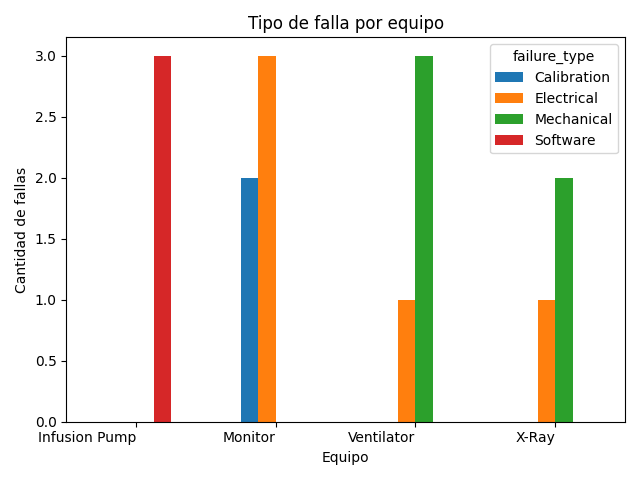

## 🏥 Medical Equipment Maintenance Analysis

This project analyzes hospital equipment maintenance data to identify patterns in failures, downtime, and repair costs. The goal is to detect high-impact equipment and propose strategies to improve operational efficiency and reduce financial losses.

---

## 📊 Objective

Identify which equipment represents the highest operational and financial risk based on:

* Failure frequency
* Downtime duration
* Maintenance cost

---

## 🛠️ Tools Used

* Python
* Pandas
* Matplotlib

---

## 📁 Dataset

The dataset includes:

* Equipment type
* Failure type
* Downtime (hours)
* Repair cost
* Technician assigned

> Note: This is a simulated dataset created for analysis purposes.

---

## 📉 Visualizations

### Downtime by Equipment

X-Ray equipment shows the highest total downtime, indicating a significant operational impact.

---

### Cost by Equipment

X-Ray also represents the highest accumulated maintenance cost, making it the most financially critical asset.

---

### Failure Types Distribution

Failures in X-Ray equipment are varied (mechanical and electrical), suggesting no single dominant failure type.

---

## 🧠 Key Insights

* X-Ray equipment has the highest downtime and maintenance cost
* Failures are distributed across multiple types, indicating system complexity
* Workload among technicians is evenly distributed, suggesting the issue is not related to staffing

---

## 🚀 Recommendations

* Prioritize maintenance strategies for X-Ray equipment
* Work closely with the equipment provider to improve service quality
* Evaluate a service contract that includes maintenance and spare parts
* Compare contract cost vs current repair expenses and downtime impact

---

## ⚠️ Limitations

* Small dataset
* Simulated data
* Limited detail on failure causes

---

## 📌 Conclusion

X-Ray equipment represents the highest operational and financial risk.
Addressing its maintenance strategy—potentially through provider support or service contracts—could significantly reduce downtime and associated costs.

---

## 👨‍💻 Author

Mariano Hernández
Biomedical Engineer | Data Analysis Enthusiast

